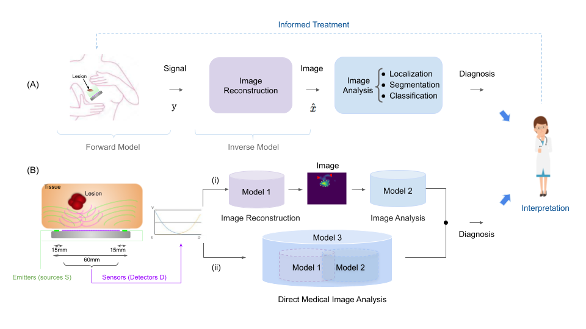

# Deep Orthogonal Multi-Frequency Fusion for Tomogram-Free Diagnosis in Diffuse Optical Imaging
This is the software repository for [our](https://www.techrxiv.org/articles/preprint/Orthogonal_Multi-frequency_Fusion_Based_Image_Reconstruction_and_Diagnosis_in_Diffuse_Optical_Tomography/21574533) [paper](#cite) solving problem of breast cancer lesion detection and discrimination in novel orthogonal multi-frequency fusion paradigms.
## Motivation
Identifying breast cancer lesions with a portable diffuse optical tomography (DOT) device can improves early detection, while avoiding otherwise unnecessarily invasive, ionizing, and more expensive modalities such as CT, as well as enabling pre-screening efficiency. 
To accurately capture the highly heterogeneous tissue of a cancer lesion embedded in healthy breast tissue with non-invasive DOT, multiple frequencies can be combined to optimize signal penetration and reduce sensitivity to noise.
We show that an orthogonal multi-frequency DOT fusion can improve reconstruction and leads to more accurate end-to-end identification of malignant from benign lesions and healthy tissue, illustrating its regularization properties on the multi-frequency input space. Furthermore, we investigates the merits of tackling the diagnosis prediction task from raw sensor data directly without image reconstruction in DOT (direct prediction) and highlighs the potential of the raw-to-task model for improved accuracy, while reducing computational complexity.

Typical breast cancer screening workflow. (A) Images reconstructed by an inverse model, from signals collected by the acquisition hardware, are analyzed for assessment, diagnosis, and treatment prognosis. (B) Screening pipelines can be divided into two paradigms: (i) Accurate reconstruction followed by image based classification. (ii) A direct prediction model omits image reconstruction to focus solely on the ultimate task and can help overcome sub-task errors, e.g., reconstruction induced false positives, marked by red triangles in this scenario, in paradigm (i)
## Keywords
Diffuse optical tomography, image reconstruction, deep learning, multi-frequency, tissue estimation, lesion classification, diagnosis, multitask learning, transfer learning, handheld probe.
## Citation
<a name="Cite"></a>
```bibtext
@article{ben2022orthogonal,
  title={Orthogonal Multi-frequency Fusion Based Image Reconstruction and Diagnosis in Diffuse Optical Tomography},
  author={Ben Yedder, Hanene and Cardoen, Ben and Shokoufi, Majid and Golnaraghi, Farid and Hamarneh, Ghassan},
  year={2022},
  publisher={TechRxiv}
}
```

## Table of contents
1. [Contribution](#contribution)
2. [Installation](#install)
3. [Usage](#usage)
4. [Questions?](#faq)

### Contribution
<a name="contribution"></a>
- We investigate the benefit of multi-frequency data on the quality of DOT reconstruction and breast lesion diagnosis using deep learning.
- We propose a novel approach designed to recover the optical properties of breast tissue from multi-frequency data with a deep orthogonal fusion model followed by a diagnosis.
- We investigate the merits of tackling the diagnosis prediction task from raw sensor data directly without image reconstruction in DOT (direct prediction).
-  We extend a fusion network by training models using an orthogonalization loss function to maximize the independent contribution of each modulation frequency data and
emphasize their collective strength. 
### Installation
<a name="install"></a>

```bash
git clone https://github.com/haneneby/FuseNet.git  
cd FuseNet
conda env create -f requirement.yml --name FuseNet
conda activate FuseNet
```
### Usage
<a name="Usage"></a>
For quick hints about commands:
```bash
cd FuseNet
python3 FuseNet++.py -h
```
#### Training
<a name="Training"></a>
```bash
export CUDA_VISIBLE_DEVICES=0 #or change to your GPU config
mkdir myoutput
cd FuseNet
python3 FuseNet++.py --epochs 100 --outputfolder ../myoutput.       #for joint reconstruction and diagnosis model
#or
python3 RawToTask++.py --epochs 100 --orth False --outputfolder ../myoutput      #for direct prediction model with disabled orthogonal fusion (Raw-To-Task)

```
This will show something like:
```bash
[FuseNet++.py:100 -          initializer() ] Writing output in /dev/shm/FuseNet/FuseNet/../myoutput
[FuseNet++.py:101 -          initializer() ] Logging directory /dev/shm/FuseNet/FuseNet/../myoutput
[FuseNet++.py:104 -          initializer() ] CONF::		 epochs -> 100
[FuseNet++.py:104 -          initializer() ] CONF::		 lr -> 0.0001
[FuseNet++.py:104 -          initializer() ] CONF::		 seed -> 2
[FuseNet++.py:104 -          initializer() ] CONF::		 device -> gpu
[FuseNet++.py:104 -          initializer() ] CONF::		 orth -> True
[FuseNet++.py:104 -          initializer() ] CONF::		 batchsize -> 16
[FuseNet++.py:104 -          initializer() ] CONF::		 beta -> 0.2
[FuseNet++.py:104 -          initializer() ] CONF::		 gamma -> 0.5
[FuseNet++.py:104 -          initializer() ] CONF::		 checkpoint -> None
[FuseNet++.py:104 -          initializer() ] CONF::		 datasetdirectory -> ./data/data_samples/
[FuseNet++.py:104 -          initializer() ] CONF::		 outputfolder -> ../myoutput
[FuseNet++.py:104 -          initializer() ] CONF::		 checkpointdirectory -> .
[FuseNet++.py:104 -          initializer() ] CONF::		 mode -> train
[FuseNet++.py:104 -          initializer() ] CONF::		 outputdirectory -> /dev/shm/FuseNet/FuseNet/../myoutput
[FuseNet++.py:104 -          initializer() ] CONF::		 logdir -> /dev/shm/FuseNet/FuseNet/../myoutput
...
Epoch 1/100
  16/1939 [..............................] - ETA: 34:23 - loss: 19.4238
```

This will train the network and save output in `myoutput`.
Examples of outputs are presented in [Figures](FuseNet/Figures) 
<!---->
#### Evaluation
For evaluation, put all your test measurments in a folder and set it path as an argument.Examples are available under [data_samples](FuseNet/data). Then run the following command:

<a name="Evaluation"></a>
```bash
mkdir myoutput
cd FuseNet
python3 FuseNet++.py  --input testdatadir --outputfolder ../myoutput  --mode test
```

The results will be saved output in `myoutput`. Pretrained models weights can be found [here](https://vault.sfu.ca/index.php/s/4fLjIzqNtvEAN31).
### Questions?
<a name="faq"></a>
Please create a [new issue](https://github.com/haneneby/FuseNet/issues/new/choose)  detailing concisely, yet complete what issue you encountered, in a reproducible way.

